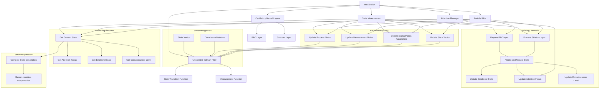

```mermaid
graph TD
    Init[Initialization] --> UKF[Unscented Kalman Filter]
    UKF --> StateTrans[State Transition Function]
    UKF --> MeasFunc[Measurement Function]
    Init --> ONL[Oscillatory Neural Layers]
    ONL --> PFC[PFC Layer]
    ONL --> Striatum[Striatum Layer]
    Init --> AttMan[Attention Manager]
    Init --> StateMeas[State Measurement]
    Init --> PF[Particle Filter]

    subgraph StateManagement
        StateVec[State Vector]
        CovMatrices[Covariance Matrices]
        StateVec --> UKF
        CovMatrices --> UKF
    end

    subgraph UpdatingTheModel
        PFCInput[Prepare PFC Input]
        StriatumInput[Prepare Striatum Input]
        PredictUpdate[Predict and Update State]
        PFCInput --> PredictUpdate
        StriatumInput --> PredictUpdate
        UpdateEmo[Update Emotional State]
        UpdateAtt[Update Attention Focus]
        UpdateConscious[Update Consciousness Level]
        PredictUpdate --> UpdateEmo
        PredictUpdate --> UpdateAtt
        PredictUpdate --> UpdateConscious
    end

    subgraph RetrievingTheState
        GetState[Get Current State]
        GetAtt[Get Attention Focus]
        GetEmo[Get Emotional State]
        GetConscious[Get Consciousness Level]
        GetState --> GetAtt
        GetState --> GetEmo
        GetState --> GetConscious
    end

    subgraph ParameterUpdates
        UpdateProcNoise[Update Process Noise]
        UpdateMeasNoise[Update Measurement Noise]
        UpdateSigmaPts[Update Sigma Points Parameters]
        UpdateStateVec[Update State Vector]
        UpdateProcNoise --> UKF
        UpdateMeasNoise --> UKF
        UpdateSigmaPts --> UKF
        UpdateStateVec --> UKF
    end

    subgraph StateInterpretation
        CompStateDesc[Compute State Description]
        CompStateDesc --> HumanReadable[Human-readable Interpretation]
    end

    StateMeas --> PFCInput
    StateMeas --> StriatumInput
    StateMeas --> GetState
    StateMeas --> UpdateProcNoise
    StateMeas --> UpdateMeasNoise
    StateMeas --> UpdateSigmaPts
    StateMeas --> UpdateStateVec

    PF --> PFCInput
    PF --> StriatumInput
    PF --> GetState
    PF --> UpdateProcNoise
    PF --> UpdateMeasNoise
    PF --> UpdateSigmaPts
    PF --> UpdateStateVec

    AttMan --> UpdateAtt
    AttMan --> GetState

    GetState --> CompStateDesc

```    