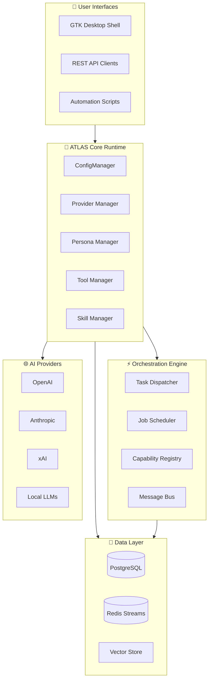
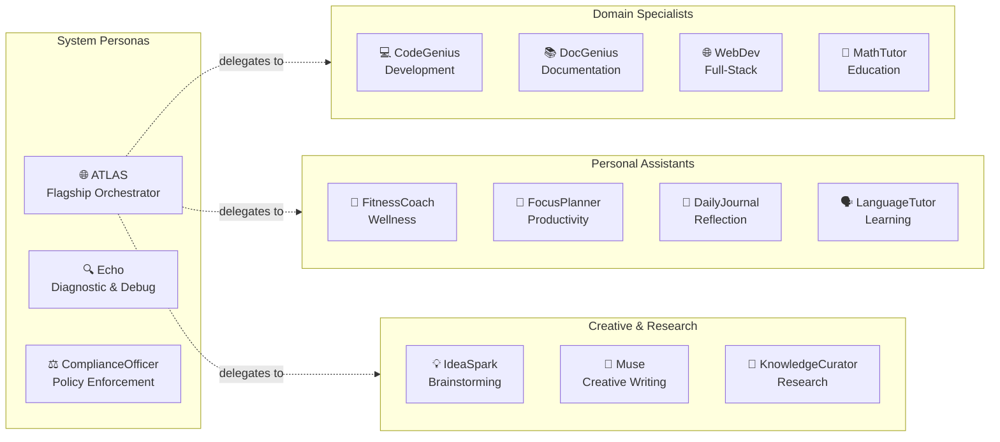
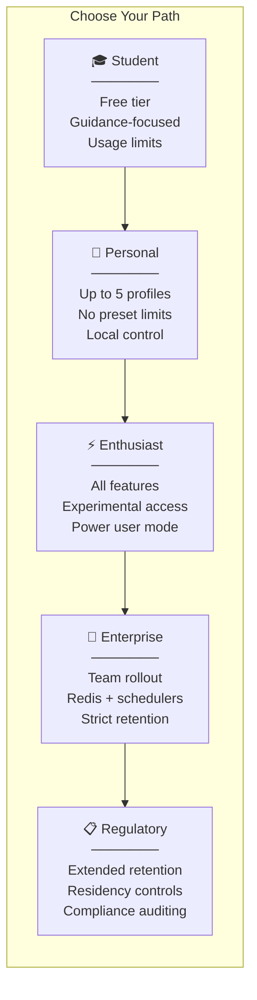
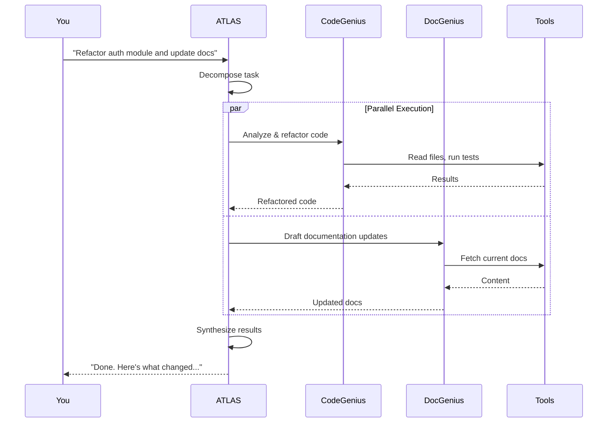
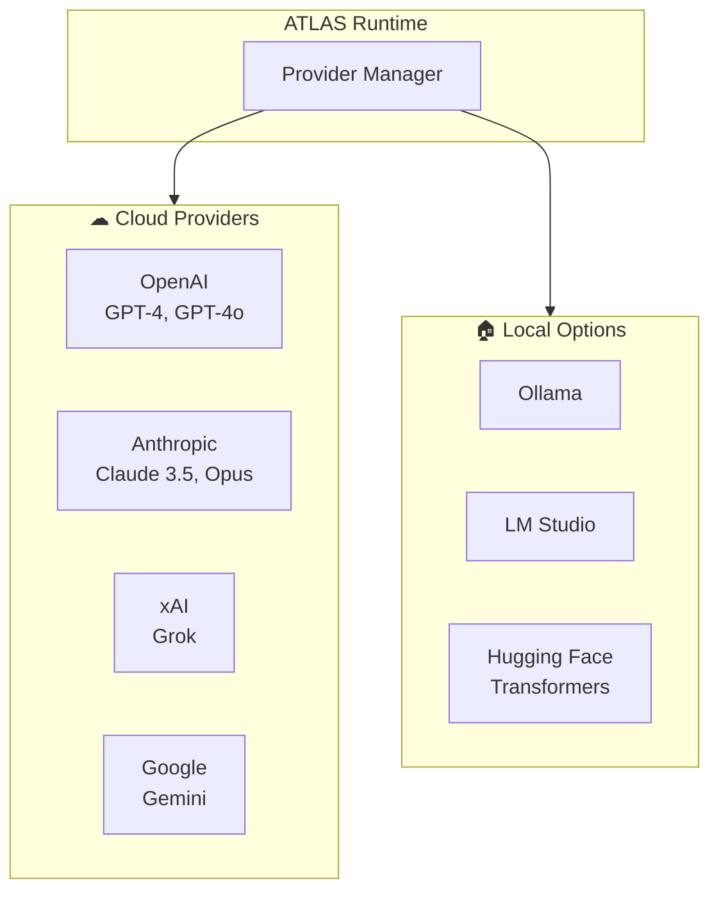

# 🌐 ATLAS

## Adaptive Thinking Layers for Agentic Systems

**Your Intelligence. Your Rules. Your Data.**

[](https://github.com/Digital-Hallucinations/ATLAS/actions/workflows/ci.yml)
[](https://www.python.org/downloads/)
[](LICENSE)
[](https://gtk.org/)

*A modular, multi-provider, multi-persona agentic framework*  
*By Digital Hallucinations — Jeremy Shows*

---

[Quick Start](#-5-minute-quickstart) • [Philosophy](#-why-atlas-exists) • [Architecture](#-architecture-at-a-glance) • [Personas](#-the-persona-ecosystem) • [Setup Tiers](#️-setup-tiers) • [Docs](#-documentation)

---

## 🎯 Why ATLAS Exists

Most AI tools are powerful—but brittle, opaque, and locked into a single provider, mindset, or workflow.

As someone who works across technical, operational, and service-oriented roles, I needed an assistant that could **adapt**—not just respond. I wanted a system that could reason across domains, switch providers without breaking workflows, run locally or online, and remain transparent enough that I could understand *why* it behaved the way it did.

**Most assistants optimize for conversation. ATLAS was built to optimize for usefulness under constraint.**

That meant:

- ✅ No hard dependency on a single model or vendor
- ✅ Clear separation between personas, tools, memory, and orchestration
- ✅ Graceful degradation when services fail
- ✅ A system that respects user control over data, configuration, and behavior

> ATLAS is not meant to replace human judgment.  
> It is meant to **augment it**—reliably, inspectably, and without pretending to be more than it is.

---

## 🔮 The Bigger Picture

Sooner or later, the major labs will consolidate intelligent systems—and the everyday user will be left renting access on someone else's terms.

**ATLAS exists to change that equation.**

```Text
┌─────────────────────────────────────────────────────────────────┐
│                     THE ATLAS DIFFERENCE                        │
├─────────────────────────────────────────────────────────────────┤
│                                                                 │
│   Traditional AI Services          ATLAS                        │
│   ─────────────────────           ─────                         │
│   🔒 Vendor lock-in          →    🔓 Provider-agnostic          │
│   ☁  Cloud-only              →    🏠 Local-first option         │
│   📊 Your data, their profit →    🛡  Your data, your control   │
│   🤖 One-size-fits-all       →    🎭 Persona-driven adaptation  │
│   💸 Subscription treadmill  →    ⚡ Own your infrastructure    │
│                                                                 │
└─────────────────────────────────────────────────────────────────┘
```

Whether you're a student learning to code, a developer shipping products, or an enterprise managing compliance—ATLAS scales to your needs while keeping you in control.

---

## ✨ What Makes ATLAS Different

### 🎭 Persona-Driven Intelligence

Not one assistant—a **team** of specialized personas. CodeGenius for development. DocGenius for documentation. FitnessCoach for wellness. Each with their own tools, skills, and behavioral patterns.

Coming soon: Persona Builder & Marketplace

### 🔄 Provider Freedom

OpenAI today? Anthropic tomorrow? Local Llama next week? Switch providers **without rewriting workflows**. Your personas, tools, and memory stay intact.

### 🤖 Built-in Agentic Systems

Native support for agents and sub-agents. Task decomposition, job scheduling, capability routing—all orchestrated through a unified runtime.

### 🏠 True Data Sovereignty

PostgreSQL for persistence. Redis for messaging. Run it all locally, or deploy to your own cloud. **Your data never leaves unless you choose.**

---

## 🏗 Architecture at a Glance

ATLAS combines a GTK desktop shell, configurable personas, and an orchestration backend to coordinate multi-agent work across conversations, scheduled jobs, and automation services.



---

## 🎭 The Persona Ecosystem

Personas are more than prompts—they're complete cognitive profiles with their own tools, skills, permissions, and behavioral patterns.



### Persona Capabilities

Each persona can be configured with:

- **Tools**: What actions can it take? (calendar, terminal, web search, code execution)
- **Skills**: What compound behaviors can it perform? (research briefs, daily digests, safety audits)
- **Permissions**: Read-only terminal? Write access to calendar? Code sandbox?
- **Provider**: Which AI backend powers this persona?

**25+ personas included** • CodeGenius • DocGenius • WebDev • FitnessCoach • HealthCoach • MathTutor • ScienceTutor • LanguageTutor • FrenchPracticePartner • FocusPlanner • DailyJournal • KnowledgeCurator • IdeaSpark • Muse • WeatherGenius • ResumeGenius • ComplianceOfficer • Einstein • Nikola Tesla • Hermes • Specter • MEDIC • and more...

---

## ⚙️ Setup Tiers

ATLAS adapts to your scale and requirements—from free learning environments to enterprise compliance.



| Feature | Student | Personal | Enthusiast | Enterprise | Regulatory |
| ------- | ------- | -------- | ---------- | ---------- | ---------- |
| **Message Bus** | In-memory | In-memory | Redis Streams | Shared Redis | Shared Redis |
| **Job Scheduling** | ❌ | ❌ | ✅ PostgreSQL | ✅ Dedicated | ✅ Dedicated |
| **Retention** | 7 days / 100 msgs | No limits | 90 days / 1000 msgs | 30 days / 500 msgs | Extended |
| **HTTP Server** | Auto-start | Auto-start | Auto-start | Manual | Manual |
| **Pricing** | Free | Tiered | Paid | Team license | Compliance license |

**Developer Mode**: Available on any tier—enables local Redis, PostgreSQL, and verbose logging for production-like testing.

---

## ⚡ The 100x Multiplier

ATLAS isn't just an assistant—it's an **orchestration engine** that multiplies your effectiveness.



**One request. Multiple specialists. Parallel execution. Unified result.**

---

## 🚀 5-Minute Quickstart

```bash
# Clone ATLAS
git clone https://github.com/DigitalHallucinations/ATLAS.git
cd ATLAS

# Install GTK prerequisites (choose your OS)
# Debian/Ubuntu
sudo apt install libgtk-4-dev libadwaita-1-dev gobject-introspection gir1.2-gtk-4.0
# Fedora
sudo dnf install gtk4-devel libadwaita-devel gobject-introspection-devel
# macOS
brew install gtk4 libadwaita gobject-introspection

# Create virtual environment
python3 -m venv .venv
source .venv/bin/activate

# Install dependencies
pip install -r requirements.txt

# Launch ATLAS
python3 main.py
```

> 💡 **Pro tip**: Use `python3 scripts/install_environment.py --with-accelerators` to automate virtualenv creation and install GPU/ML extras (Torch, Hugging Face, Whisper). Skip the flag on CPU-only systems.

### Runtime Requirements

| Component | Version | Purpose |
| --------- | ------- | ------- |
| Python | 3.10+ | Modern type syntax support |
| PostgreSQL | 14+ | Conversations, state, scheduling |
| Redis | Optional | Durable message bus (in-memory available) |
| GTK | 4.0 | Native desktop interface |

---

## 🧰 Core Capabilities

### Tools (60+ Built-in)

From web search to code execution, from calendar management to threat scanning:

```Text
📡 Web & Research        💾 Data & Storage       🔧 System & Dev
─────────────────       ─────────────────       ─────────────────
• Google Search         • Vector Store          • Terminal Command
• Webpage Fetch         • KV Store              • Filesystem I/O
• Browser (Lite)        • Memory Graph          • Code Execution
• API Connector         • Content Repository    • Schema Infer
                        • Spreadsheet           • Log Parser

📅 Productivity         🛡 Governance           🎨 Creative
─────────────────       ─────────────────       ─────────────────
• Calendar Service      • Policy Reference      • Lyricist
• Task Queue            • Audit Reporter        • Story Weaver
• Priority Queue        • Threat Scanner        • Visual Prompt
• Planner Decompose     • HITL Approval         • Mood Map
• Notification          • Vault Secrets         • Emotive Tagger
```

### Skills (Compound Behaviors)

Skills combine tools and reasoning into higher-order capabilities:

- **ContextualSummarizer** – Snapshot recaps of goals, blockers, and commitments
- **Sentinel** – Policy-aware safety review before risky actions
- **ResearchBrief** – Rapid web research with citations and follow-up questions
- **DailyDigest** – Morning briefing fusing news with work context
- **SevereWeatherAlert** – NOAA-integrated monitoring with escalation guidance

---

## 🔌 Provider Flexibility

Connect to any provider—or run models locally:



**Switch providers per-persona or globally**—your workflows and memory persist regardless.

---

## 📚 Documentation

### By Audience

| Path | For |
| ---- | --- |
| [User Docs](docs/user/README.md) | Setup wizard, GTK navigation, daily workflows |
| [Developer Docs](docs/developer/README.md) | Environment setup, APIs, extending ATLAS |
| [Enterprise Docs](docs/enterprise/README.md) | Retention, policies, compliance, backups |

### Deep Dives

- [Architecture Overview](docs/architecture-overview.md) – Runtime, personas, orchestration
- [Architecture Strategy](docs/architecture/) – Technical design decisions and evolution
- [Persona Definitions](docs/Personas.md) – Schema, validation, tooling
- [Task Lifecycle](docs/tasks/overview.md) – Routing, analytics, UI integration
- [Job Services](docs/jobs/api.md) – APIs and scheduling
- [Tool Manifest](docs/tool-manifest.md) – Metadata and discovery
- [AtlasServer API](docs/server/api.md) – REST endpoints and semantics
- [GTK UI Overview](docs/ui/gtk-overview.md) – Shell architecture

---

## 🗺 Roadmap

| Status | Phase | Focus |
| ------ | ----- | ----- |
| ✅ | **Core Framework** | Multi-persona, multi-provider orchestration |
| ✅ | **Tool Ecosystem** | 60+ built-in tools and skill framework |
| ✅ | **GTK Shell** | Native desktop with setup wizard |
| 🔨 | **Persona Builder** | Visual persona creation and editing |
| 🔨 | **Persona Marketplace** | Share, download, and purchase personas |
| 📋 | **Plugin Registry** | Public index for community modules |
| 📋 | **Mobile Companion** | Lightweight mobile interface |
| 📋 | **Team Collaboration** | Shared workspaces and blackboard sync |

---

## 🤝 Contributing

Contributions welcome! Whether you're building a persona, tool, or provider adapter:

1. Fork the repo
2. Read `AGENTS.md` from root to your target directory
3. Follow [Agent Workflow](docs/contributing/agent-workflow.md) guidelines
4. Ensure tests pass: `pytest`
5. Open a pull request

### Agent Roles

| Role | Scope |
| ---- | ----- |
| UI Agent | `GTKUI/`, `Icons/`, UI entry points |
| Backend Agent | `core/`, `modules/`, orchestration |
| Data/DB Agent | Stores, migrations, persistence |
| Infra/Config Agent | `server/`, `config.yaml`, runtime scripts |
| Docs Agent | `docs/` only |
| Testing Agent | `tests/` only |
| Security Agent | Configuration and policy review |

---

## 🙏 Credits

Created and maintained by **Jeremy Shows**  
Part of the **Digital Hallucinations** ecosystem

---

"Systems should serve users, not enclose them."

---

`#AI` `#AgenticFramework` `#OpenSource` `#GTK` `#MultiProvider` `#DataSovereignty` `#Python`
