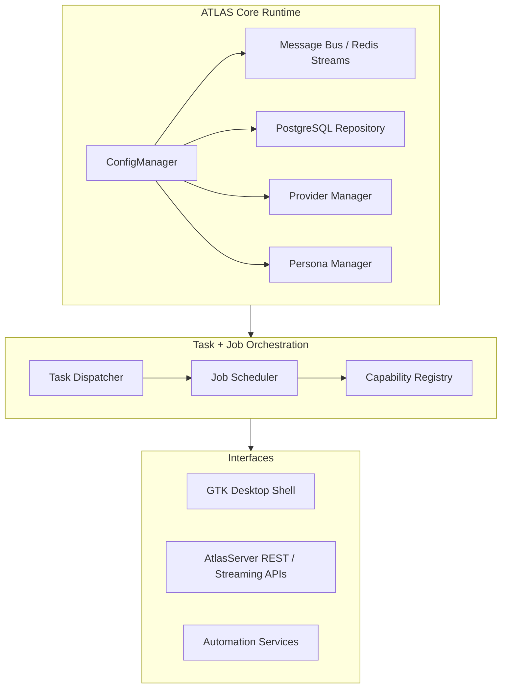

# 🧠 ATLAS
[](https://github.com/Digital-Hallucinations/ATLAS/actions/workflows/ci.yml)
### Modular, Multi-Provider, Multi-Persona Agentic Framework  
*By Digital Hallucinations — Jeremy Shows*

---

> **ATLAS** combines a GTK desktop shell, configurable personas, and an orchestration back end to coordinate multi-agent work across conversations, scheduled jobs, and automation services.  
>  
> It merges **systemic orchestration** with **personal agency**, forming a unified runtime where configuration, provider management, persona logic, and automation coexist under one roof.

Where other frameworks chase closed ecosystems, ATLAS emphasizes **control**, **autonomy**, and **adaptability**.  
It allows you to define not just *what* an agent does, but *how* it thinks, *who* it represents, and *which* provider powers it — all from a locally controlled, extensible environment.

---

## 🌍 Core Philosophy

ATLAS exists to give creators control over the frameworks that define their agents.  
Every design choice supports *freedom from lock-in* and *clarity of orchestration*.

> “I wanted features that mainstream companies only offered fractured examples of —  
> and the freedom to make it do what I want, not what a corporation or government says I can.”

Built under the **Digital Hallucinations** ecosystem, ATLAS merges precision engineering with persona-driven cognition and modular autonomy.

---

## 🧩 Major Subsystems

- **GTK Desktop Shell** –  
  `main.py` boots a GTK 4 application that initializes ATLAS instances on demand, launches the first-run coordinator, and keeps setup, shell, and window controllers alive for the duration of the session.

- **Persona Runtime** –  
  Persona definitions, toolboxes, and validation rules live under `modules/Personas/` and are documented in the persona guide.  
  They control which tools, skills, and collaboration patterns each persona can access, and include task manifests for persona-specific workflows.

- **Orchestration Back End** –  
  The orchestration layer manages message-bus communication, task dispatch, job planning, and capability registry services that feed both automation APIs and UI analytics.

---

## 🧠 High-Level Architecture

At startup, ATLAS configures message-bus backends, speech services, persona and provider managers, and the PostgreSQL-backed conversation repository via the central `ConfigManager`.

The orchestration stack layers task and job managers on top of that state, while the embedded **AtlasServer** exposes REST routes for conversations, tasks, jobs, tools, skills, and collaboration surfaces.  
This shared infrastructure lets the GTK shell, automation jobs, and external callers operate against the same message bus, storage, and capability registries.



---

## ⚙️ Runtime Prerequisites

* **Python 3.10+** – uses modern union type syntax (e.g., `ATLAS | None`).
* **PostgreSQL 14+** – backs conversation history, key-value state, and scheduling primitives.
* **Redis (optional)** – durable message-bus backend; in-memory queues available for local dev.
* **SQLAlchemy with PostgreSQL dialect and pgvector** – required for the conversation store bootstrap flow; install with `pip install SQLAlchemy pgvector psycopg[binary]`.

Follow the [developer environment setup runbook](docs/ops/developer-setup.md) to create the virtual environment, install dependencies, and choose between CLI or GTK setup flows.
Review the [configuration reference](docs/configuration.md) to map environment variables and YAML blocks before first launch.

---

## 📡 Messaging configuration

Drive non-interactive setup runs or fine-tune the messaging stack with environment variables:

- `ATLAS_MESSAGE_BUS_BACKEND`, `ATLAS_REDIS_URL`, `ATLAS_STREAM_PREFIX` – choose the backend and Redis connection details.
- `ATLAS_MESSAGING_INITIAL_OFFSET`, `ATLAS_MESSAGING_REPLAY_START` – control whether the bus tails (`$`) or replays (`0-0`) past messages.
- `ATLAS_MESSAGING_TIER`, `ATLAS_MESSAGING_DLQ_ENABLED`, `ATLAS_MESSAGING_DLQ_TEMPLATE` – set the default policy tier and dead-letter queue template.
- `ATLAS_MESSAGING_RETENTION_SECONDS`, `ATLAS_MESSAGING_TRIM_MAXLEN` – retention and stream trimming knobs.
- `ATLAS_MESSAGING_IDEMPOTENCY_ENABLED`, `ATLAS_MESSAGING_IDEMPOTENCY_KEY`, `ATLAS_MESSAGING_IDEMPOTENCY_TTL` – idempotency hints for topic policies.
- `ATLAS_KAFKA_ENABLED`, `ATLAS_KAFKA_BOOTSTRAP`, `ATLAS_KAFKA_TOPIC_PREFIX`, `ATLAS_KAFKA_CLIENT_ID`, `ATLAS_KAFKA_DRIVER`, `ATLAS_KAFKA_IDEMPOTENCE`, `ATLAS_KAFKA_ACKS`, `ATLAS_KAFKA_MAX_IN_FLIGHT`, `ATLAS_KAFKA_DELIVERY_TIMEOUT` – Kafka sink bootstrap, topic prefixing, and idempotence controls.
- `ATLAS_BRIDGE_ENABLED`, `ATLAS_BRIDGE_TOPICS`, `ATLAS_BRIDGE_BATCH_SIZE`, `ATLAS_BRIDGE_MAX_ATTEMPTS`, `ATLAS_BRIDGE_BACKOFF_SECONDS`, `ATLAS_BRIDGE_DLQ_TOPIC` – Redis-to-Kafka bridge toggles, topic list, batching, retry, backoff, and DLQ routing.

---

## 🪶 Installation

```bash
# Clone ATLAS
git clone https://github.com/DigitalHallucinations/ATLAS.git
cd ATLAS

# Install GTK build prerequisites (choose the command for your OS)
# Linux (Debian/Ubuntu)
sudo apt install libgtk-4-dev libadwaita-1-dev gobject-introspection gir1.2-gtk-4.0
# Linux (Fedora)
sudo dnf install gtk4-devel libadwaita-devel gobject-introspection-devel
# macOS (Homebrew)
brew install gtk4 libadwaita gobject-introspection

# Create a virtual environment
python3 -m venv .venv
source .venv/bin/activate

# Install dependencies (base runtime)
pip install -r requirements.txt

# Optional: install Hugging Face fine-tuning, local Whisper STT, and accelerator extras
# (Skip this step on CPU-only hosts.)
pip install -r requirements-accelerators.txt

# Confirm GTK bindings are available
python -c "import gi"
```

> 💡 Use `python3 scripts/install_environment.py --with-accelerators` to automate both the
> virtualenv creation and optional accelerator extras installation. The extras layer pulls in
> Torch, Hugging Face fine-tuning stacks, and local Whisper tooling—run without the flag on
> CPU-only hosts to skip those GPU-focused packages.

---

## 🚀 Launching the Desktop Shell and Automation APIs

Start the GTK shell from the repository root:

```bash
python3 main.py
```

The application initializes the ATLAS runtime and presents the primary window or, when configuration is missing, guides you through the setup wizard.
Server and automation surfaces live in `modules/Server/`, where `AtlasServer` wires REST and streaming routes for conversations, tasks, jobs, tools, skills, and shared blackboard collaboration.
Tool discovery endpoints (e.g., `/tools`) and capability registries feed downstream automations and dashboards.

---

## 🧰 Features

* 🧠 Multi-Persona Management — define and switch between intelligent, specialized personas.
* 🌐 Multi-Provider Layer — dynamically select between OpenAI, Anthropic, xAI, or local LLMs.
* 🧩 Extensible Tools — universal tool API for integrating retrieval, scheduling, or external modules.
* 🪶 GTK Interface — sleek, native desktop environment for agent orchestration.
* 🎙️ GPT-4o Live Speech-to-Text — capture microphone audio in-app for GPT-4o transcription (requires `sounddevice`/`soundfile`).
* 🔐 Privacy & Local Autonomy — all control stays local; no enforced cloud dependency.
* 🔄 Persistent Context — PostgreSQL-backed state and modular message-bus design.
* 🧭 Unified Orchestration — conversations, jobs, and automations share a single runtime.

---

## 🧾 Documentation Map

Start with the audience-specific landing pages, then drill into topic guides:

* [User docs](docs/user/README.md) – setup wizard, GTK UI navigation, and day-to-day workflows
* [Developer docs](docs/developer/README.md) – environment setup, configuration references, personas, tools, and API surfaces
* [Enterprise docs](docs/enterprise/README.md) – retention, password policies, export controls, and backups

Topic deep-dives:

* [Setup Wizard](docs/setup-wizard.md) – guided configuration and bootstrap flow
* [Persona Definitions](docs/Personas.md) – schema, validation, and persona-specific tooling
* [Task Lifecycle Overview](docs/tasks/overview.md) – routing, analytics, and UI integration
* [Job Services](docs/jobs/api.md) / [Job Dashboards](docs/jobs/ui.md) – APIs and analytics
* [Tool Manifest Metadata](docs/tool-manifest.md) / [Generated Tool Catalog](docs/generated/tools.md)
* [Task Queue](docs/tools/task_queue.md) / [Key-Value Store](docs/tools/kv_store.md)
* [Conversation Retention](docs/conversation_retention.md) – policy and workers
* [Conversation Store Data Model](docs/conversation-store.md) – PostgreSQL schema and helpers
* [User Account Management](docs/user-accounts.md) – credentials, lockouts, and operator flows
* [Shared Blackboard](docs/blackboard.md) – collaborative API surfaces
* [AtlasServer API Reference](docs/server/api.md) – REST endpoints and semantics
* [Architecture & Codebase Tour](docs/architecture-overview.md) – deeper walkthrough of runtime, personas, and orchestration
* [Operations Runbooks](docs/ops/README.md) – dev environment and bus deployment guides
* [GTK UI Overview](docs/ui/gtk-overview.md) – workspace controllers and extensions

---

## 🧭 Project Roadmap

| Phase                       | Focus                                                |
| --------------------------- | ---------------------------------------------------- |
| ✅ **Core Framework**        | Multi-persona, multi-provider orchestration          |
| 🧩 **Tool Ecosystem**       | Expand universal built-ins and automation primitives |
| 🪶 **UI Enhancements**      | Themes, visualization, live context tracing          |
| ⚡ **CI/CD + Testing**       | GitHub Actions, linting, and coverage                |
| 🔄 **Plugin Registry**      | Public index for ATLAS modules and personas          |
| 💬 **Documentation Portal** | Interactive docs and tutorials                       |

---

## 🤝 Contributing

Contributions are welcome.
If you’d like to build a persona, tool, or provider adapter, fork the repo and open a pull request.
Follow PEP 8 and ensure tests pass with `pytest` before submitting.

### Agent roles, guardrails, and AGENTS lookup
- UI Agent (GTKUI/), Backend Agent (ATLAS/, modules/, atlas_provider.py), Data/DB Agent (conversation/task/job stores and migrations), Infra/Config Agent (server/, config.yaml, ATLAS/config/, scripts/ affecting runtime), Docs Agent (docs/), Testing Agent (tests/), and Security Agent (configuration reviews).
- Always read `AGENTS.md` from the repository root down to the directory you’re editing; nested files override parent guidance and document additional required checks.

### Workflow, audits, and new audit folders
- Follow the shared [Agent Workflow](docs/contributing/agent-workflow.md) for intent capture, guardrail discovery, design alignment, validation, and traceability.
- Documentation updates must refresh `docs/_audit/inventory.md` and `docs/_audit/architecture-alignment-report.md` to keep traceability current.
- When spinning up a new audit folder, start with the [_audit_template](docs/_audit_template) and adapt it to the new scope before adding content.

### Required validations by change type
- Backend/infra changes: run `pytest tests/test_persona_schema.py` and `pytest`.
- UI changes: run the tests above and capture updated screenshots for visible GTK modifications.
- Documentation-only changes: refresh the audit inventory/report, and run link or spell checks if available before submitting.

---

## 🜂 Credits

Created and maintained by **Jeremy Shows**
Part of the **Digital Hallucinations** ecosystem.

> “ATLAS isn’t just an assistant — it’s a framework for agency.”

---

## 📣 Tags

`#AI` `#AgenticFramework` `#OpenSource` `#GTK` `#MultiProvider` `#DigitalHallucinations` `#Python`
