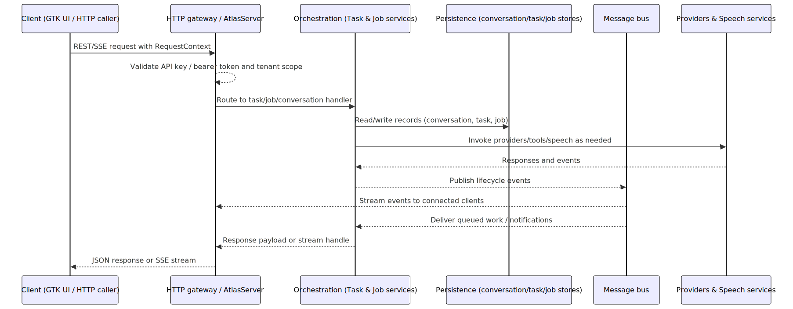

# ATLAS Architecture & Codebase Tour

This guide expands on the README with a deeper walkthrough of the runtime, files, and development workflows. It is aimed at new contributors who want an end-to-end picture of how the GTK shell, persona runtime, orchestration layer, and server fit together.

## Entry Points & Configuration Flow

- **`main.py`** starts a `Gtk.Application`, runs the first-run coordinator, and lazily instantiates the core `ATLAS` runtime only after setup passes the `is_setup_complete()` check.
- **`ATLAS/ATLAS.py`** constructs the application runtime: it loads configuration via `ConfigManager`, establishes the message bus, initializes speech, personas, providers, chat session plumbing, and creates the `AtlasServer` plus repositories/services used by the UI and APIs.
- **Configuration sources** come from `config.yaml` plus environment variables (see `docs/configuration.md`). `ConfigManager` also verifies the PostgreSQL conversation store before the runtime proceeds.

## Runtime Composition

- **Messaging**: The **AgentBus** provides a high-level typed messaging API backed by the **Neural Cognitive Bus (NCB)**. The NCB offers 36+ domain-specific channels (e.g., `user.input`, `llm.request`, `tool.invoke`, `task.created`), priority queues, idempotency, and optional Redis/Kafka bridging. Configure via `configure_agent_bus()` during initialization. See [Messaging Runbook](ops/messaging.md) for deployment patterns.
- **Conversation store**: `modules/conversation_store/` holds the SQLAlchemy models and `ConversationStoreRepository` that enforces retention policies for conversations, user/account relationships, and vector embeddings. Task and job records live in the dedicated repositories under `modules/task_store/` and `modules/job_store/`; the conversation store does not persist that orchestration data.
- **Speech**: `modules/Speech_Services/` contains the `SpeechManager` plus TTS/STT integrations. The runtime exposes a `SpeechService` facade so the UI and APIs can request status or streaming updates.
- **Personas & providers**: persona manifests and schemas live under `modules/Personas/`. The `PersonaManager` loads persona definitions, while `ProviderManager` resolves which LLM provider/model is active and dispatches tool calls through the shared tooling service.
- **User accounts**: `modules/user_accounts/` adds login and lockout flows. `UserAccountFacade` links auth state to the conversation repository so multi-tenant data stays isolated via `tenant_id`.

### Server topology & data flow

The diagrams below summarize how AtlasServer, orchestration services, and storage layers are wired together, plus how a typical request travels through the stack.





## Orchestration & Automation

- **Tasks & jobs**: The `modules/orchestration/` package hosts the `TaskManager`, `JobManager`, `JobScheduler`, capability registry, and supporting blackboard for collaborative state. These services share the message bus and repository state initialized by the core runtime.
- **Background tasks**: Utilities in `modules/background_tasks.py` run async work in threads so long-running orchestration can coexist with the GTK event loop and API handlers.
- **Tooling**: `ATLAS/services/tooling.py` wraps the `ToolManager` module to validate tool usage against persona manifests and emit events that the orchestration layer can observe.

## Server & Interfaces

- **AtlasServer**: Defined under `modules/Server/`, the server exposes REST and streaming endpoints for conversations, tasks, jobs, tools, skills, and blackboard operations. The GTK shell and external clients both call into this API surface.
- **GTK UI**: The `GTKUI/` package contains the desktop shell. `GTKUI/Setup/first_run.py` coordinates the setup wizard, while `GTKUI/sidebar.py` hosts the main window and routes UI actions to the runtime through injected factories.

## Personas in Practice

- **Layout**: Each persona resides in `modules/Personas/<Name>/Persona/` with JSON manifest files, prompts, and optional tools/skills manifests.
- **Schema**: The repository ships a canonical schema at `modules/Personas/schema.json`; run `pytest tests/test_persona_schema.py` to validate new personas.
- **Access control**: Persona manifests enumerate allowed tools/skills and can toggle collaboration protocols, which the tooling service enforces during request execution.

## Data & Persistence

- **Database**: PostgreSQL backs conversations, user accounts, and vector embeddings retained by the conversation store. Task and job data are persisted via the dedicated task/job repositories (`modules/task_store/`, `modules/job_store/`), separate from the conversation store. The runtime will abort startup if `ConfigManager.is_conversation_store_verified()` fails.
- **Knowledge store (RAG)**: The `modules/storage/knowledge/` package provides the persistence layer for RAG (Retrieval-Augmented Generation). Knowledge bases, documents, and vector-embedded chunks are stored via `KnowledgeStore` implementations (PostgreSQL with pgvector). See the [RAG Developer Guide](developer/rag-integration.md) for integration patterns.
- **Audit & logging**: `modules/logging/` provides the structured logger and persona-aware audit log hooks so automation and UI actions share consistent telemetry.
- **Key-value helpers**: Support utilities in `docs/tools/kv_store.md` and the queue helpers in `docs/tools/task_queue.md` describe the supporting data-plane utilities used by orchestration services.

## RAG (Retrieval-Augmented Generation)

ATLAS includes a full-featured RAG system for knowledge management and context-aware conversations.

### Architecture Components

```Text
┌─────────────────────────────────────────────────────────┐
│                      RAGService                         │
│              (ATLAS/services/rag/)                      │
├─────────────────────────────────────────────────────────┤
│  ┌─────────────┐ ┌─────────────┐ ┌──────────────────┐  │
│  │ EmbedManager│ │KnowledgeStore│ │DocumentIngester │  │
│  └─────────────┘ └─────────────┘ └──────────────────┘  │
└─────────────────────────────────────────────────────────┘
        │                 │                  │
        ▼                 ▼                  ▼
   ┌─────────┐     ┌───────────┐     ┌────────────┐
   │OpenAI   │     │PostgreSQL │     │File Parser │
   │Sentence │     │pgvector   │     │Chunking    │
   │Transform│     │           │     │            │
   └─────────┘     └───────────┘     └────────────┘
```

### Data Flow

1. **Document Ingestion**: Files are uploaded via the KB Manager UI or API, parsed by `DocumentIngester`, chunked according to KB settings, and stored in `KnowledgeStore`.
2. **Embedding Generation**: `EmbedManager` generates vector embeddings for each chunk using configured providers (OpenAI, Sentence Transformers, etc.) and stores them alongside the text.
3. **Search/Retrieval**: Queries are embedded and compared via vector similarity (cosine distance) against chunk embeddings. Top-k results are returned with relevance scores.
4. **Context Injection**: Retrieved chunks are formatted as context and injected into LLM prompts during conversations with RAG-enabled knowledge bases.

### Key Modules

| Module | Location | Purpose |
| ------ | -------- | ------- |
| **RAGService** | `ATLAS/services/rag/` | Orchestration facade for all RAG operations |
| **KnowledgeStore** | `modules/storage/knowledge/` | Base class and PostgreSQL implementation |
| **DocumentIngester** | `ATLAS/services/rag/ingestion.py` | File parsing, chunking, batch processing |
| **EmbedManager** | `ATLAS/services/rag/embedding.py` | Embedding provider abstraction layer |
| **KB Manager UI** | `GTKUI/KnowledgeBase/` | GTK4 interface for KB management |

### UI Components

The KB Manager (`GTKUI/KnowledgeBase/kb_manager.py`) provides:

- **Knowledge base CRUD**: Create, configure, delete knowledge bases
- **Document management**: Upload files, ingest URLs, view/delete documents
- **Chunk visualization**: Browse chunks, edit content, view embeddings
- **Embedding scatter plot**: 2D PCA visualization of chunk embeddings
- **Query testing**: Test searches against KBs with configurable top-k
- **Export/Import**: Export KBs to ZIP, import from ZIP archives

### Configuration

RAG settings are managed under the `rag:` key in `config.yaml`. See [Configuration Reference](configuration.md#rag-retrieval-augmented-generation) for all options including:

- Embedding provider and model selection
- Default chunk size and overlap
- Search parameters (top-k, score threshold)
- PostgreSQL pgvector index settings

### Related Documentation

- [RAG User Guide](user/rag-guide.md) - End-user documentation
- [RAG Developer Guide](developer/rag-integration.md) - API integration patterns
- [Configuration Reference](configuration.md#rag-retrieval-augmented-generation) - All RAG settings

## Budget Manager

ATLAS includes a comprehensive budget management system for tracking API costs, enforcing spending limits, and generating usage reports across all AI providers.

### Budget Architecture Components

```text
┌─────────────────────────────────────────────────────────┐
│                    BudgetManager                        │
│                (modules/budget/)                        │
├─────────────────────────────────────────────────────────┤
│  ┌─────────────┐ ┌─────────────┐ ┌──────────────────┐  │
│  │UsageTracker │ │AlertEngine  │ │ReportGenerator   │  │
│  └─────────────┘ └─────────────┘ └──────────────────┘  │
│  ┌─────────────┐ ┌─────────────┐                       │
│  │PricingReg.  │ │BudgetStore  │                       │
│  └─────────────┘ └─────────────┘                       │
└─────────────────────────────────────────────────────────┘
        │                 │                  │
        ▼                 ▼                  ▼
   ┌─────────┐     ┌───────────┐     ┌────────────┐
   │Provider │     │PostgreSQL │     │Config      │
   │Pricing  │     │Storage    │     │Manager     │
   │Data     │     │           │     │            │
   └─────────┘     └───────────┘     └────────────┘
```

### Budget Data Flow

1. **Usage Recording**: Provider integrations call `UsageTracker.record_usage()` after each API request with token counts, model info, and user context.
2. **Cost Calculation**: `PricingRegistry` looks up model pricing and calculates costs based on input/output tokens, image generation, or embedding dimensions.
3. **Policy Evaluation**: `BudgetManager` checks recorded usage against configured policies (global, user, provider, or model scopes).
4. **Alert Generation**: `AlertEngine` evaluates threshold rules and generates alerts when spending approaches or exceeds limits.
5. **Reporting**: `ReportGenerator` aggregates usage data into summary, trend, comparison, and projection reports.

### Budget Modules

| Module | Location | Purpose |
| ------ | -------- | ------- |
| **BudgetManager** | `modules/budget/manager.py` | Central coordinator singleton |
| **UsageTracker** | `modules/budget/tracking.py` | Records and aggregates usage |
| **PricingRegistry** | `modules/budget/pricing.py` | Model pricing database |
| **AlertEngine** | `modules/budget/alerts.py` | Threshold evaluation and notifications |
| **ReportGenerator** | `modules/budget/reports.py` | Usage analytics and exports |
| **BudgetStore** | `modules/budget/persistence.py` | Database persistence layer |

### Budget UI Components

The Budget Manager UI (`GTKUI/Budget_manager/`) provides:

- **Dashboard**: Current spending, budget progress, top providers/models
- **Policy Editor**: Create and manage budget policies with scope, period, and action settings
- **Usage History**: Browse detailed usage records with filtering
- **Reports View**: Generate and export usage reports (JSON, CSV, Markdown)
- **Alerts Panel**: View and acknowledge budget alerts

### Supported Providers

The pricing registry includes current pricing for:

- **OpenAI**: GPT-4o, GPT-4o-mini, GPT-4, o1, o1-mini, DALL-E 3, text-embedding-3, Whisper
- **Anthropic**: Claude Sonnet 4, Claude 3.5 Sonnet/Haiku, Claude 3 Opus/Sonnet/Haiku
- **Google**: Gemini 2.5/2.0/1.5 Pro/Flash
- **Mistral**: Mistral Large, Ministral, Pixtral, Codestral
- **Groq**: LLaMA models, Mixtral
- **xAI**: Grok 2/3/3-mini

### Budget Configuration

Budget settings are managed under the `budget:` key in `config.yaml`. See [Budget Manager Documentation](budget-manager.md) for all options including:

- Global enable/disable
- Default limits and soft limit percentages
- Alert channels and cooldown settings
- Pre-configured policies

### Budget Related Documentation

- [Budget Manager Guide](budget-manager.md) - Full user and API documentation
- [Configuration Reference](configuration.md#budget-manager) - All budget settings

## Development & Testing

- **Environment setup**: Follow `docs/ops/developer-setup.md` or run `python3 scripts/install_environment.py --with-accelerators` to provision the virtualenv and optional GPU extras.
- **Running the app**: Start the desktop shell with `python3 main.py`. The first-run wizard will prompt for required configuration before the runtime is created.
- **Tests**: Execute `pytest` for the full suite and `pytest tests/test_persona_schema.py` for fast persona validation. Conversation-store verification and background worker checks run automatically during runtime construction, so failures there usually indicate configuration gaps.
- **Code search**: Use `rg` for repository searches (avoid `grep -R` in this codebase) and rely on the documentation map in `README.md` for topic-specific docs.

## How to Explore Next

- Trace a conversation lifecycle by following `ChatSession` in `modules/Chat/chat_session.py` and its integration with the `ConversationService` facade.
- Inspect the `modules/Server/routes/` definitions to see how REST handlers map to orchestration functions.
- Review persona manifests and skill/tool metadata under `modules/Personas/` to understand how capabilities are granted.
- Look at the job dashboard docs (`docs/jobs/ui.md`) and API reference (`docs/jobs/api.md`) to connect orchestration data to UI analytics.
