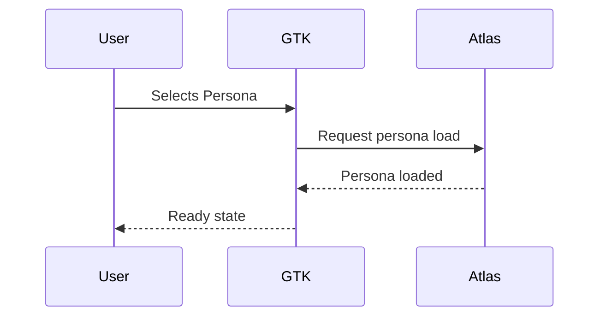

# Visual asset guidelines

Use this guide when adding diagrams, flow charts, or screenshots to ATLAS documentation.

## Authoring priority
- Start with **text-first diagrams** using Mermaid fenced code blocks for sequence, flow, or state diagrams so diffs stay readable and quick to review.
- When a graphical tool is necessary (for example, high-fidelity UI mockups), **export to `.svg`** to preserve scalability and searchability.
- Only fall back to **`.png`** when your tooling cannot export vector assets. If you must use `.png`, prefer high-DPI output and keep the source (for example, the design file) linked in the surrounding text.

### Mermaid usage example
Embed Mermaid directly in Markdown to keep diagrams versionable alongside the surrounding narrative:

```markdown

```

When a diagram requires a static image (for example, a complex UI mockup exported from Figma), place the exported asset under `docs/assets/` (see layout below) and embed it with an alt description:

```markdown

```

## Accessibility and readability
- Provide descriptive **alt text** that conveys intent and key details (for example, actors, state changes, and outcomes) instead of generic labels such as “diagram.”
- Maintain **color contrast** that meets WCAG AA for text and key shapes (use accessible palettes and avoid contrast-dependent meaning).
- Prefer **text in Markdown** over words baked into images; if labels must live in the asset, use legible fonts with sufficient size and weight to read in both dark and light themes.
- Keep annotations and callouts consistent with the surrounding narrative—avoid watermarking or dense text overlays that compete with captions.

### Quick accessibility checklist
- [ ] Alt text clearly states what the visual shows and why it matters.
- [ ] Fonts and annotations are readable in dark and light modes (no low-contrast combinations).
- [ ] Text is in Markdown when possible; any in-asset text uses a legible font and size.

## Directory layout
- Store visuals under `docs/assets/` and group them by topic to keep related files discoverable.
  - UI diagrams: `docs/assets/ui/`
  - Server/API diagrams: `docs/assets/server/`
  - Add additional subfolders as needed (for example, `docs/assets/ops/` or `docs/assets/data/`) to match the documentation section you are updating.
- Keep assets near the pages they serve (for example, `docs/ui/gtk-overview.md` should pull from `docs/assets/ui/`).

### Source files
- Keep editable source files (for example, `.mmd`, `.drawio`, or design exports) alongside their rendered counterparts under a `src/` subfolder that mirrors the asset path (for example, `docs/assets/ui/src/` for UI diagrams).
- Commit both the source and the exported asset so reviewers can iterate on updates without recreating diagrams from scratch.

## Naming and versioning
- Use **kebab-case** file names: `conversation-router-sequence.png`, `setup-wizard-overview.svg`.
- Include a version or date stamp when replacing an existing visual: `message-bus-topology-v2.png` or `persona-review-2026-03-09.svg`.
- Prefer vector or high-resolution sources when possible (`.svg` or high-DPI `.png`) and avoid embedding exported PDFs directly.
- Keep descriptive alt text in the filename when it improves searchability (for example, `setup-wizard-preflight-scorecard-v1.svg`).

## Embedding visuals in Markdown
Use relative paths that stay within the docs tree so links remain stable when moved.

```markdown


```

If a doc sits deeper in the tree, adjust the relative path accordingly (for example, ``).

## Sizing and alignment
- Target a **maximum width of 960px** for exported assets to avoid stretching the documentation layout; prefer vector formats that scale without blurring.
- Use standard Markdown image embeds for most cases. If a visual needs centering, wrap the image in a short HTML block that keeps the element responsive:

```html
<div align="center">
  
</div>
```

- Avoid hard-coding heights; let images resize naturally to preserve aspect ratio and readability on narrower screens.

## Replacement checklist
- [ ] Place the new asset in the correct section folder under `docs/assets/`.
- [ ] Rename the file to kebab-case with a version or date suffix when supplanting an older diagram.
- [ ] Update the Markdown embed with the new path and alt text.
- [ ] Remove or archive superseded assets if they are no longer referenced.

## Reviewer checklist
- [ ] Source files are present under `docs/assets/.../src/` alongside exported assets.
- [ ] Alt text is descriptive and present for every embed.
- [ ] Image links are relative and stay within the `docs/` tree.
- [ ] Diagram content matches the current feature set and UI flows.

## Optional validation
- Lint Mermaid blocks if available to catch syntax errors early.
- Spot-check relative paths and embeds by serving the docs locally: `python3 -m http.server` from the `docs/` directory.
