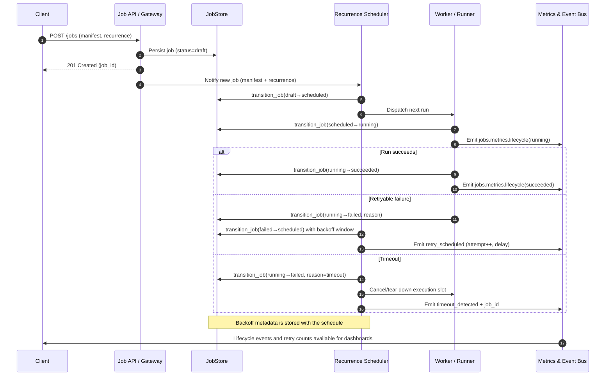

# Job lifecycle

Jobs progress through draft, scheduled, running, and terminal states (`succeeded`, `failed`, or `cancelled`). Lifecycle transitions are validated in `modules.job_store.service.JobService.transition_job`, which checks persona rosters, linked task completion, and scheduling prerequisites before persisting changes.

Lifecycle events generate analytics via `modules.analytics.persona_metrics.record_job_lifecycle_event`. Each event persists to `persona_metrics.json`, records the transition metadata, and publishes a `jobs.metrics.lifecycle` message on the internal bus for dashboards or external consumers. The payload includes:

- `job_id`, `persona`, and `tenant_id`
- `event` (`created`, `status_changed`, `completed`, `failed`, `cancelled`, etc.)
- `from_status`/`to_status`
- `success` and `latency_ms`
- Arbitrary metadata (for example `sla_met`, escalation context, or task rollups)

## State machine and enforcement

Allowed transitions are defined in `_ALLOWED_TRANSITIONS` within `JobService`:

- `draft` → `scheduled`, `running`, or `cancelled`
- `scheduled` → `running` or `cancelled`
- `running` → `succeeded`, `failed`, or `cancelled`
- Terminal states (`succeeded`, `failed`, `cancelled`) do not allow further transitions.

Additional guards include:

- **Roster checks**: Persona rosters (`metadata.personas`) are required when moving into `scheduled` or `running` and are used to assert ownership for downstream actions.
- **Schedule checks**: Jobs transitioning into `scheduled` or `running` must carry `metadata.recurrence` (populated by the scheduler) to keep manifests and persisted schedules aligned.
- **Dependency checks**: Linked tasks must be completed (statuses `done` or `cancelled`) before `running` jobs can move to `succeeded`.
- **Optimistic concurrency**: Routes accept `expected_updated_at` so API clients can avoid stomping intermediate updates.

## Scheduling, retry, and timeout flow

The sequence below highlights how the scheduler advances jobs, how retries are queued, and how timeouts are enforced.  
_Source: [docs/assets/jobs/job-retry-timeout-sequence.mmd](../assets/jobs/job-retry-timeout-sequence.mmd)._

## Metrics and message topics

`PersonaMetricsStore.get_job_metrics` aggregates lifecycle events by persona or tenant. Metrics include:

- Total lifecycle events and success/failure counts
- Average transition latency (`latency_ms`)
- Recent event history (configurable window)
- Status distributions and per-job summaries
- Calculated throughput (terminal events per hour)
- SLA adherence (counts and breach ratio when metadata contains `sla_met` or `sla_breached`)

Dashboards retrieve these analytics through `get_job_lifecycle_metrics` (exposed through the Capability Registry summary). Consumers listening to `jobs.metrics.lifecycle` should expect normalized ISO8601 timestamps suffixed with `Z`.

Cross-reference the [task lifecycle guide](../tasks/overview.md#ui-and-dashboards) for how task transitions complement job analytics and feed combined success rollups.
