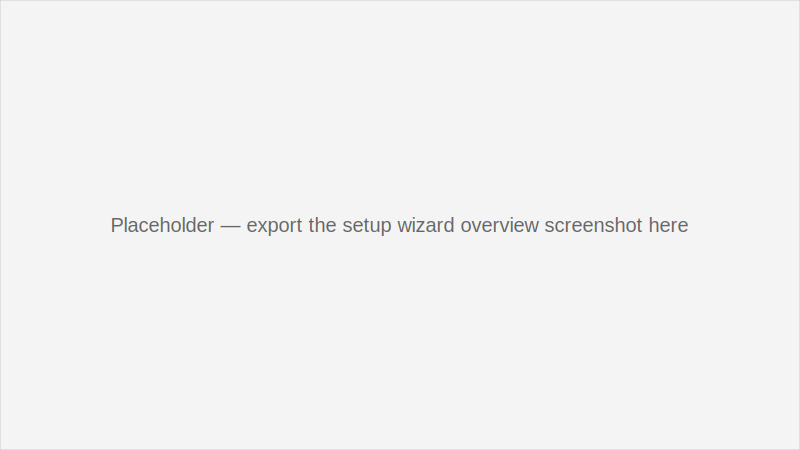
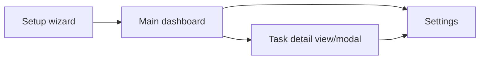

# GTK desktop shell overview

## Boot sequence and application lifetime
- `main.py` creates a `Gtk.Application`, lazily instantiates the `ATLAS` core, and hands control to `FirstRunCoordinator` when the application is activated.【F:main.py†L18-L51】
- `FirstRunCoordinator` makes sure the core is initialized (or falls back to the setup wizard), then presents the primary `MainWindow` once initialization succeeds.【F:GTKUI/Setup/first_run.py†L19-L129】
- The coordinator retains references to the ATLAS instance, the main window, and any setup window so they remain alive for the duration of the GTK session.【F:main.py†L44-L48】【F:GTKUI/Setup/first_run.py†L83-L112】

## Main window and navigation shell
`MainWindow` is the top-level `AtlasWindow` that binds ATLAS services to UI controllers. It applies shared styling, builds the horizontal layout (sidebar, divider, notebook), and constructs management controllers with access to the shared ATLAS instance.【F:GTKUI/sidebar.py†L32-L71】 The tool and skill controllers expose "open in persona" callbacks that the window wires back into persona management so cross-navigation stays in sync.【F:GTKUI/sidebar.py†L45-L59】

### Notebook page lifecycle
Pages are lazily created through `_open_or_focus_page`, which caches the widget, attaches a close button, and tracks optional controller instances so `_close_page` can call `_on_close_request` during teardown.【F:GTKUI/sidebar.py†L445-L512】 Navigation helpers such as `show_task_workspace` and `show_job_workspace` invoke `get_embeddable_widget()` on their managers, then focus specific records by scheduling idle callbacks into the manager (`focus_task`, `focus_job`, etc.).【F:GTKUI/sidebar.py†L122-L160】【F:GTKUI/sidebar.py†L538-L551】

### Navigation sidebar and history
`_NavigationSidebar` builds the left-hand navigation with primary actions (providers, chat, tools, tasks, jobs, skills, speech, personas), history slots, and footer actions (accounts, settings). Each entry wraps a callback to the corresponding `MainWindow.show_*` method.【F:GTKUI/sidebar.py†L640-L804】 The sidebar also listens for conversation history events from the ATLAS core so recent chats can be surfaced without reopening the history page manually.【F:GTKUI/sidebar.py†L766-L771】

### Inline job controls
`MainWindow` centralizes job transitions because multiple workspaces trigger them. Helper methods (`start_job`, `pause_job`, `resume_job`, `rerun_job`) normalize context, forward the request to `atlas.server`, and surface toast notifications through the window when transitions succeed.【F:GTKUI/sidebar.py†L218-L375】

## Embedded management controllers
Each workspace controller accepts the shared ATLAS instance and parent window so it can request backend services, show dialogs, and surface toasts.

| Manager | Module | Responsibilities | Key signals & callbacks |
| --- | --- | --- | --- |
| PersonaManagement | `GTKUI/Persona_manager/persona_management.py` | Registers for persona messages, renders persona configuration tabs, tracks tool/skill state, and produces analytics/history views backed by ATLAS persona data.【F:GTKUI/Persona_manager/persona_management.py†L25-L76】 | Uses `ATLAS.register_message_dispatcher` to display persona notifications via GTK dialogs and routes updates through GLib idle handlers.【F:GTKUI/Persona_manager/persona_management.py†L47-L124】 |
| ProviderManagement | `GTKUI/Provider_manager/provider_management.py` | Lists configured providers, opens provider-specific settings windows, and drives provider selection using the ATLAS config manager and background tasks.【F:GTKUI/Provider_manager/provider_management.py†L19-L164】 | Switches providers with `ATLAS.set_current_provider_in_background` callbacks and shows result dialogs on GLib idle to keep UI responsive.【F:GTKUI/Provider_manager/provider_management.py†L141-L165】 |
| ToolManagement | `GTKUI/Tool_manager/tool_management.py` | Loads tool catalogs from the server, supports persona-scoped filtering, renders tool metadata/history, and persists persona tool enablement back through the persona manager.【F:GTKUI/Tool_manager/tool_management.py†L36-L195】 | Exposes `focus_tool` for cross-navigation, invokes `persona_manager.set_allowed_tools`, and can call `on_open_in_persona` when users jump into persona settings.【F:GTKUI/Tool_manager/tool_management.py†L123-L195】【F:GTKUI/sidebar.py†L45-L55】 |
| SkillManagement | `GTKUI/Skill_manager/skill_management.py` | Displays the skill catalog, evaluates persona compatibility, and orchestrates preview/test flows while keeping track of history exports.【F:GTKUI/Skill_manager/skill_management.py†L56-L190】 | Calls into `persona_manager` to resolve persona context, toggles persona/tool enablement actions, and uses `on_open_in_persona` for deep links back to persona tooling.【F:GTKUI/Skill_manager/skill_management.py†L1400-L1468】【F:GTKUI/sidebar.py†L45-L55】 |
| TaskManagement | `GTKUI/Task_manager/task_management.py` | Retrieves task lists and catalogs from the ATLAS server, renders both list and Kanban board layouts with shared filters, and provides state transitions for draft/ready/in-progress/review workflows.【F:GTKUI/Task_manager/task_management.py†L355-L404】【F:GTKUI/Task_manager/task_management.py†L215-L343】【F:GTKUI/Task_manager/task_management.py†L972-L1038】 | Subscribes to task-related bus events via `subscribe_bus_event`, schedules UI refreshes on GLib idle, and reports errors back through the parent window.【F:GTKUI/Task_manager/task_management.py†L1051-L1082】 |
| JobManagement | `GTKUI/Job_manager/job_management.py` | Lists scheduled jobs, loads detail metadata (linked tasks, escalation policies), and presents persona/status filters for the job pipeline.【F:GTKUI/Job_manager/job_management.py†L322-L351】【F:GTKUI/Job_manager/job_management.py†L855-L886】 | Subscribes to job-related bus events, refreshes the workspace on updates, and leverages the parent window for error dialogs and toasts.【F:GTKUI/Job_manager/job_management.py†L1174-L1209】 |

Other workspaces (chat, conversation history, speech settings, accounts) follow the same pattern: they expose embeddable widgets that `MainWindow` can add to the notebook and rely on the shared ATLAS object for backend calls.【F:GTKUI/sidebar.py†L76-L213】

## Extending the GTK UI
1. **Create or wire a controller** – Implement a class that exposes `get_embeddable_widget()` (and optional `focus_*` helpers) so it can be embedded in the notebook like existing managers.【F:GTKUI/Tool_manager/tool_management.py†L123-L162】【F:GTKUI/Task_manager/task_management.py†L88-L132】
2. **Add a navigation entry** – Instantiate the controller in `MainWindow.__init__`, then call `_NavigationSidebar._create_nav_item` with a new `show_*` method that invokes `_open_or_focus_page` to register the notebook tab.【F:GTKUI/sidebar.py†L35-L160】【F:GTKUI/sidebar.py†L683-L804】【F:GTKUI/sidebar.py†L445-L483】
3. **Route cleanup hooks** – If the controller allocates background resources (bus subscriptions, workers), implement `_on_close_request` so `_close_page` can tear them down when the tab closes.【F:GTKUI/sidebar.py†L489-L512】【F:GTKUI/Task_manager/task_management.py†L118-L132】【F:GTKUI/Job_manager/job_management.py†L118-L136】
4. **Call into ATLAS services safely** – Reach backend APIs via `atlas.server`, `atlas.persona_manager`, or other managers, always wrapping calls with context (tenant IDs) and defensive error handling as demonstrated in the existing controllers.【F:GTKUI/Task_manager/task_management.py†L355-L374】【F:GTKUI/Job_manager/job_management.py†L322-L337】【F:GTKUI/Tool_manager/tool_management.py†L167-L195】
5. **Surface cross-navigation** – Expose `focus_*` functions and optional callbacks (like `on_open_in_persona`) so other controllers or notification handlers can guide the user directly to relevant records.【F:GTKUI/Tool_manager/tool_management.py†L123-L162】【F:GTKUI/sidebar.py†L538-L565】

With these patterns, new pages inherit the same lifecycle as existing workspaces: they are lazily constructed, share the ATLAS backend, appear in the notebook with closable tabs, and participate in global navigation and messaging via the `MainWindow` shell.【F:GTKUI/sidebar.py†L445-L551】

### Task workspace layouts

The task workspace exposes a stack switcher that toggles between the traditional list and a segmented Kanban board. Both layouts consume the same persona/status/search filters, so switching views never loses context. Dragging a card between columns triggers the underlying status transition flow, mirroring the primary and secondary action buttons in the detail pane.【F:GTKUI/Task_manager/task_management.py†L215-L343】【F:GTKUI/Task_manager/task_management.py†L972-L1050】【F:GTKUI/Task_manager/task_management.py†L1200-L1393】

## UI reference placeholders
The following embeds track where refreshed UI captures will land. Swap in the final exports while keeping the same filenames and relative paths.

*Placeholder caption: setup wizard welcome and configuration overview. TODO: replace with final export.*

*Placeholder caption: main dashboard with primary navigation sidebar, recent activity, and workspace tabs. TODO: replace with final PNG export.*

*Placeholder caption: task details modal or side panel showing lifecycle controls and metadata. TODO: replace with final PNG export.*

### Navigation flow (placeholder)
> TODO: Replace this placeholder Mermaid diagram with the finalized navigation flow export once captures are available.

